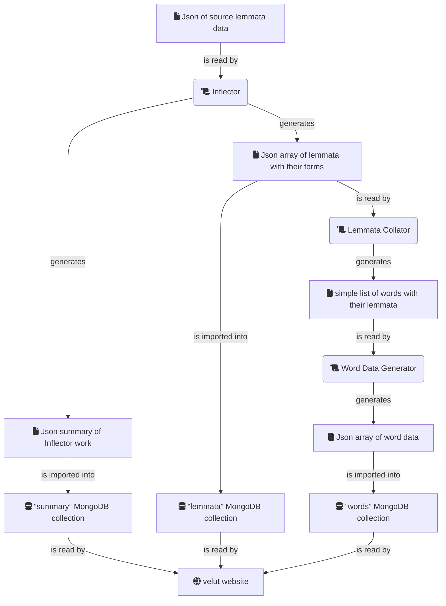

# Plan for decoupling velut from Excel

For context, see [this project’s readme](https://github.com/DuncanRitchie/velut#readme). If none of this makes sense to you, I apologize.

I’ve already made several webpages made with vanilla HTML/CSS/JavaScript that I use to manage velut, in addition to the gigantic Excel file. I’ll probably be making more webpages and Node scripts to fulfil the steps below. The steps are (mostly) in chronological order.

A [diagram of the new architecture](#diagram-of-new-architecture) is after the plan.

More words and statistics are on a dedicated <a href="https://www.velut.co.uk/deexcellation">de-Excellation page</a> of the velut website.
And now that this plan is nearing completion, I have an [article on my blog](https://www.duncanritchie.co.uk/blog/deexcellation-of-velut) explaining the entire process of ridding velut of Excel.

- [x] Port velut to Next.js. <ins>Completed 2022-07-23.</ins>
- [x] Write this plan for how to finish the de-Excellation of velut. <ins>Done 2022-07-23, though I have added to the plan since.</ins>
- [x] Decide whether to cancel my Render subscription for serving the MERN version. <ins>Subscription suspended 2022-09-10.</ins>
- [x] Write a [blogpost about how I ported velut to Next.js](https://www.duncanritchie.co.uk/blog/porting-velut-to-nextjs). This isn’t urgent, but I should write it before I forget what I did! <ins>Eventually completed 2023-01-28.</ins>
- [x] Make a webpage (or similar) that replaces the Excel sheet `wordsform`, which generates the phonetic data (etc) for each word. (Top-right in the [Excel screenshot](https://github.com/DuncanRitchie/velut#excel) in the readme.) It doesn’t need database access. <ins>[Word Data Generator](https://github.com/DuncanRitchie/velut-word-data-generator) completed 2022-09-29.</ins>
- [x] For each lemma in velut, generate the list of forms already in velut. This should be something that can be repeated easily whenever I add to the Excel file. A webpage that has `<textarea>`s for relevant data would suffice. Name it the Forms Collator (or something better). <ins>[Forms Collator](https://github.com/DuncanRitchie/velut-forms-collator) completed 2022-10-08.</ins>
- [x] Export the manually-entered data of `lemmata` into Json. (This is the Excel sheet bottom-left in the screenshot.) <ins>Done 2022-10-09.</ins>
- [x] Stop adding words to the Excel file. <ins>I haven’t touched the Excel file since 2022-10-09.</ins> <ins>I’ve opened the file but only to confirm that everything in it I also had elsewhere.</ins>
- [x] Write something that generates an empty list for each lemma. Name it the [Inflector](https://github.com/DuncanRitchie/velut-inflector). <ins>Done 2022-10-15</ins>
- [x] Write tests that compare the output of the Forms Collator (the lists of forms already in velut) to the output of the Inflector (a set of empty lists, at this point in time). The tests will fail for all lemmata. <ins>Done 2022-10-15</ins>
- [x] Make the Inflector return the lemma for conjunctions and prepositions, which will make some tests pass. <ins>Done 2022-10-15</ins>
- [x] Make the Inflector return the forms for each lemma as an object containing all parsing data. I don’t want an array of simple strings (`["amō","amās","amat",...]`) for each lemma, but something more like this (for a verb): 

<pre><code>
          {
            "unencliticized": {
              "indicative": {
                "active": {
                  "present": {
                    "singular": {
                      "1st": ["amō"],
                      "2nd": ["amās"],
                      "3rd": ["amat"]
                    }
                  }
                }
              }
            }
          }
</code></pre>
<ins>Done 2022-10-15</ins>

- [x] Make sure tests can handle what the Inflector generates. If the Forms Collator gives `["amō","amās","amat"]` and the Inflector gives the object above, the tests should pass because the forms are the same. Order does not matter. <ins>Done 2022-10-15</ins>
- [x] Handling for enclitics — make it so that all forms (where relevant) generated by the Inflector have encliticized forms as well as the unencliticized form. The enclitics in Latin are ‘[-que](https://www.velut.co.uk/-que)’, ‘[-ne](https://www.velut.co.uk/-ne)’, and ‘[-ve](https://www.velut.co.uk/-ve)’. (Exemptions include conjunctions and lemmata already ending in “-que” such as ‘[quisque](https://www.velut.co.uk/quisque)’. The word ‘ūsquene’ is attested, however.) <ins>Done 2022-10-15</ins>
- [x] Add whatever special cases need to be added to make all the tests pass for conjunctions and prepositions. (Because some conjunctions/prepositions have forms other than the lemma.) <ins>Done 2022-10-15</ins>
- [x] Make the Inflector generate the positive/comparative/superlative forms for adverbs. (Some adverbs will need to be marked as not having comparative/superlatives. There may be other special cases too.) <ins>Done 2022-10-30</ins>
- [x] Make the Inflector generate the forms for adjectives. (Some adjectives will need to be marked as not having comparative/superlatives/etc. There may be other special cases too.) <ins>Done 2022-11-13, though I’m temporarily excluding comparatives/superlatives that are not already in velut.</ins>
- [x] Continue for pronouns, nouns (including proper nouns), and verbs. <ins>Pronouns finished 2022-11-18. Non-proper nouns finished 2022-12-10, though I cut a couple of corners with third-declension I-stem nouns. Proper nouns finished 2022-12-30. Verbs finished 2023-04-30. Then I returned to the third declension. This step finished 2023-05-08.</ins>
- [x] Eventually the list of words in Excel will match that generated by the Inflector, or at least be a subset thereof. (Order does not matter.) Tests will pass. <ins>The Inflector generates all the forms that were in Excel, as of when I completed the previous step on 2023-05-08.</ins>
- [x] Create a local version of the MongoDB database for use in development. So far I’ve been running my development server off the production database, which has been perfectly fine — but it makes sense to have a separate database at this step. <ins>Completed 2023-05-20.</ins>
- [x] Make the parsing data generated by the Inflector get merged into the Json file for the `lemmata` MongoDB collection. Every lemma will have the `Lemma`, `PartOfSpeech`, `Meanings` (etc) fields that it currently has, but also a `Forms` field that is the object of parsing data. <ins>Completed 2023-05-20.</ins>
- [x] Replace the `lemmata` collection in the _local_ MongoDB with the output of the previous step. <ins>Completed 2023-05-20.</ins>
- [x] Add inflection-tables _locally_ on the front-end, using the output of the Inflector in the _local_ database. <ins>Completed 2023-05-28.</ins> 
      An example from Wiktionary: 
      
- [x] Ensure I can push the inflection-table work to production and _not_ see the inflection-tables on the live website. The flat list of forms will continue to be shown if a lemma doesn’t have the `Forms` field. <ins>True as of 2023-05-28.</ins>
- [x] Decide whether inflection-tables should include encliticized forms. <ins>True as of 2023-05-28 — I’ve made a nice tabs component to switch between enclitics.</ins>
- [x] Confirm that, if unencliticized forms are generated that are not in Excel, they are _all_ worthy of being added to velut, for _some_ parts of speech. Seeing the forms in the tables will help with this. <ins>Proper nouns finished 2023-09-16. Conjunctions finished 2023-09-17. Pronouns finished 2023-09-23.</ins>
- [x] Create a page on the velut website that shows my progress in checking the output of the Inflector. (This and the steps below that relate to an environment variable were not in my original plan, but I decided to do them after I finished writing the Inflector and started checking its output. It will take a while for me to confirm the forms for all lemmata, and there’s not much point in waiting so long before displaying the inflection-tables for some lemmata.) <ins>Done 2023-08-05 — here’s the <a href="https://www.velut.co.uk/deexcellation">page that explains about the Inflector</a>.</ins>
- [x] Create an environment variable to control which lemmata can be displayed with generated forms — set it to all parts of speech locally, but only proper nouns, conjunctions, and pronouns for the live website. <ins>Done 2023-09-30.</ins>
- [x] Replace the `lemmata` collection in production with the contents of the local `lemmata` collection, which includes generated forms. This will make inflection-tables appear for some lemmata on the live website. <ins>Done 2023-09-30.</ins>
- [x] Confirm that, if unencliticized forms are generated that are not in Excel, they are _all_ worthy of being added to velut, for _all_ parts of speech. When each part of speech has been checked, update both the `lemmata` collection and the environment variable in production, so the forms appear. <ins>Nouns finished 2024-01-14. Prepositions finished 2024-01-27. Interjections finished 2024-01-28. Adverbs finished 2024-02-17. Third-declension adjectives finished 2024-04-12. Other adjectives finished 2024-07-20. Deponent 1st-conjugation verbs finished 2024-10-17. Deponent 2nd-conjugation verbs finished 2024-10-20. Other deponent verbs finished 2024-10-27. Semi-deponent verbs finished 2024-11-03. First-conjugation verbs finished 2025-01-22. Second-conjugation verbs finished 2025-02-15. Third-conjugation verbs finished 2025-04-30. Fourth-conjugation verbs finished 2025-05-14. All other lemmata (irregular verbs) finished 2025-05-31.</ins>  
      Note from 2024-10-18 — Because all the lemmata I have left to check are verbs, and going through all verbs will take a while, I have allowed verbs that have been checked to have their inflection-tables displayed on the live website.
      For other verbs, the list of forms from Excel will continue to be shown.
      The environment variable is still useful for documenting which parts of speech I’ve finished checking.
- [x] Consider removing the environment variable that controls which lemmata have inflection-tables — at this point, all lemmata should have them, even on the live website. <ins>Env var removed 2025-05-31.</ins>
- [x] Implement programmatic handling of ambiguously stressed forms.  
      What do I mean by this?  
      Some pairs of lemmata have particular forms that are identical except for the stress.
      For example, ‘[dominus](https://www.velut.co.uk/dominus)’ “lord” and ‘[dominium](https://www.velut.co.uk/dominium)’ “banquet” both have a genitive singular ‘[dominī](https://www.velut.co.uk/domini-)’, stressed on the first syllable for “of the lord” and on the second for “of the banquet”.
      In velut, I differentiate between the two by putting an acute accent on ‘[domínī](https://www.velut.co.uk/domi.ni-)’ “of the banquet”.  
      (I don’t put the acute on words that don’t need it due to not matching a word with a different stress.
      Eg, words like ‘[imperī](https://www.velut.co.uk/imperi-)’ — genitive singular of ‘[imperium](https://www.velut.co.uk/imperium)’ — have the stress on penultimate syllable just like ‘domínī’, but there’s no other way of stressing ‘imperī’, so I forgo the accent.)  
      Currently, I apply the acute accent manually… if I notice that forms can coincide like this. I’d like to have an automated solution. <ins>Implemented 2025-06-01.</ins>
- [x] Check that the previous step hasn’t changed any of the data, beyond correcting any accenting mistakes that may exist. <ins>Diff checked 2025-06-01.</ins>
- [x] Refactor code for the Inflector. <ins>Some refactoring done up to 2025-06-22.</ins>
- [x] Check that the previous step hasn’t changed any of the data. <ins>True as of 2025-06-22.</ins>
- [x] Create a script that reads the parsing data that was generated by the Inflector, and condenses them into the simple “word and its lemmata” format that the Word Data Generator requires. (This is like the reverse of the Forms Collator: a Lemmata Collator.) <ins>[Lemmata Collator](https://github.com/DuncanRitchie/velut-lemmata-collator) finished 2025-06-23.</ins>
- [x] Run the output of the Lemmata Collator through the Word Data Generator. <ins>Done 2025-06-23. There were 2,099,608 words and the generator took 2 hours 17 minutes 8.925 seconds to process them, plus 5.049 seconds to concatenate the output into one file. Hopefully I can improve on this!</ins> <ins>Yes I can improve on that — processing is down to 25 minutes 0 seconds as of 2025-07-05.</ins> 
      (At this point I could also paste the output of the Lemmata Collator back into the `wordsform` Excel sheet that the Word Data Generator replaces. Excel would probably crash though.)
- [x] Replace the `words` collection in MongoDB _locally_ with the output of the Word Data Generator in the previous step. <ins>Done 2025-06-23.</ins>
- [x] Perhaps make some quick fixes to the user interface — the number of rhymes given for a word should not be too huge, inflection-tables and lists of forms should not appear on the “English to Latin” page, etc. <ins>This was definitely needed because a word like ‘incommodissimumque’ has 41,470 rhymes (and that’s perfect rhymes) and it’s very inconvenient. Done 2025-07-02 — we now have pagination on the lists of rhymes.</ins>
- [x] Replace the two collections in the production database with the local data. The new words and inflection-tables will now all be on the live website. <ins>Done 2025-07-05.</ins>
- [x] Ensure that whatever script I have to update a database updates both databases. <ins>True as of 2025-07-10 — I have a nice little Batch script that runs the Inflector, Lemmata Collator, and Word Data Generator, and imports the results to the local & production databases. And it waits for me to give it permission for each of those actions; this means it doesn’t have to do every action every time, and I can check how the results look in the Json or on the local instance before launching the next step.</ins>
- [x] Check that it is relatively easy to add vocabulary to velut. <ins>Done 2025-07-11.</ins> This means:

      1. adding a lemma (or several!) to my relevant Json file,
      2. getting the inflected forms with the Inflector,
      3. passing the forms into the Word Data Generator via the Lemmata Collator,
      4. manually checking that the data are correct,
      5. importing to MongoDB (both locally and for production), and
      6. manually checking that the words look correct on the live website.

- [x] Ensure everything in the Excel file exists outside of it. <ins>True as of 2025-07-13.</ins>
- [x] Evaluate whether I should discard the development database and switch back to using the production database in development. <ins>I’m keeping the development database, as of 2025-07-13.</ins>
- [x] At this point, there’s a `summary` MongoDB collection, which is used by the webpage that shows my progress with de-Excellation (/deexcellation). Make sure the website isn’t reading from this collection anywhere except on the /deexcellation page. (This step and some of the steps below were not in the original plan, but were added on 2025-07-20.) <ins>Done 2025-07-20.</ins>
- [x] Write a blog article about the de-Excellation of velut, adapted from this plan and the webpage for showing my progress. The article should include a diagram of the new architecture (see below), the code for the Batch script (without database credentials, of course), and an explanation that the `summary` collection was useful and now isn’t. <ins>[Article on de-Excellation](https://www.duncanritchie.co.uk/blog/deexcellation-of-velut) published 2025-08-16. I also published [some relevant graphs](https://www.duncanritchie.co.uk/blog/graphs-of-lemma-and-word-counts) in another article.</ins>
- [x] Update the readme in this repo. It should have a link to the blog article, and no link to this plan or the /deexcellation page. <ins>Done 2025-08-18.</ins>
- [ ] Delete the /deexcellation page.
- [ ] Delete the `summary` collection, locally and in production.
- [x] Evaluate whether the Excel file can be deprecated. <ins>File evaluated as obsolete 2025-07-13. To be fair, it’s been pretty much obsolete since 2022-10-09.</ins>
- [ ] Continue adding words and going through issues. (I have several private Trello boards, including several for velut.)

When all the steps above have been ticked and dated, I will delete this file (plan.md).

## Diagram of new architecture

### Explanation of diagram

The Json of source lemmata data is read by the Inflector, which generates a Json summary of Inflector work, which is imported into the `summary` MongoDB collection. The Inflector also generates a Json array of lemmata with their forms, which is imported into the `lemmata` MongoDB collection and is read by the Lemmata Collator. The Lemmata Collator generates a simple list of words with their lemmata, which is read by the Word Data Generator to generate a Json array of word data, which is imported into the `words` MongoDB collection. The three MongoDB collections are read by the velut website.

(Note that the “summary” of Inflector work is only useful while I’m moving to the new architecture, since it’s used by the [de-Excellation page](https://www.velut.co.uk/deexcellation) that displays my progress with that. If I delete that page, I can get rid of that branch of the diagram and go back to having only two MongoDB collections.)

### Diagram

